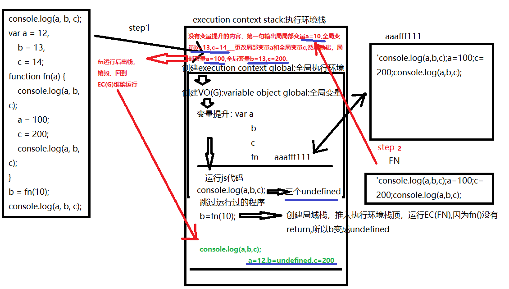

## 第一周正式课-课后作业
### 一、
#### 1、
> undefined   13
#### 2、
> 报错：a is not defined,后面不再运行
#### 3、
> 不会  结果是报错：Cannot access 'a' before initaialization
### 二、

> undefined undefined undefined
> 10 13 14
> 100 13 200
> 12 undefined 200
### 三、

> [12,23]
> [0]
> [100,23]
### 四、

> 10    10   
### 五、

> 1
>  {name:'jack'}
### 六、

> f a(){}
### 七、
#### 7-1

> 输出 undefined
> undefined
> 12
#### 7-2

> undefined
> 12
> 13
#### 7-3

> 报错 a is not defined
### 八、

> 10
### 九、
> 10
> 11
> 3
### 十、
> undefined
### 十一、
> 3
> 10
> undefined
### 十二、
> hello/hello/hello (这个不太懂)